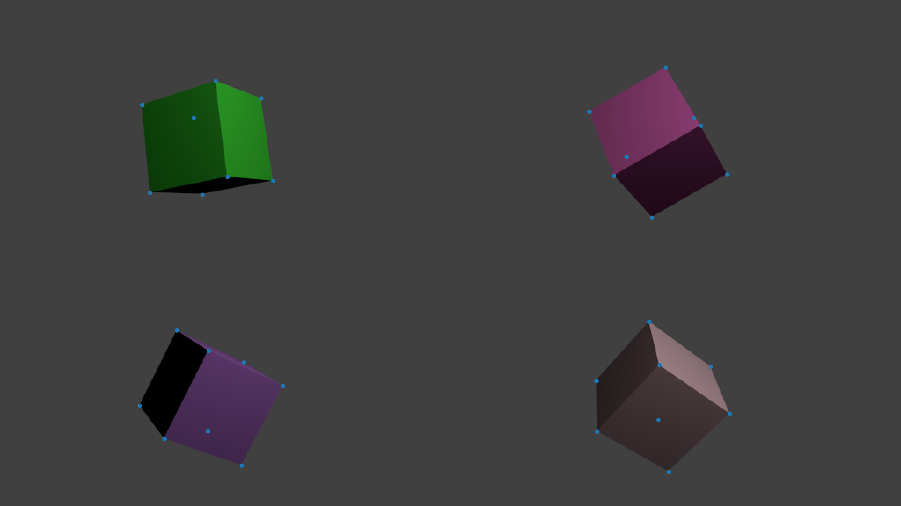
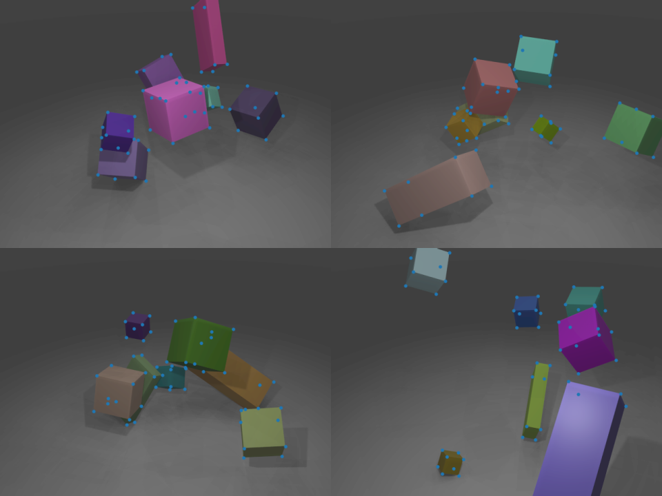

# blendtorch

**blendtorch** is a Python framework to seamlessly integrate [Blender](http://blender.orf) renderings into [PyTorch](http://pytorch.org) datasets for deep learning from artificial visual data. We utilize Eevee, a new physically based real-time renderer, to synthesize images and annotations at 60FPS and thus avoid stalling model training in many cases.

Feature summary
- Blender Eevee support for real-time rendering.
- Seamless streaming into PyTorch data pipelines.
- Supports arbitrary pickle-able objects to be send alongside images/videos.
- Builtin recording capability to replay data without Blender.

## Minimal sample
Running [demo.py](./demo.py) using the [cube](./scenes/) scene
```
python demo.py cube
```
will generate batch visualizations in `./tmp/output_##.png` like the following



This image is generated by reading from 2 Blender instances that randomly perturbate a minimal scene. Individual results (images + corner annotations) are received through a standard PyTorch `Dataset`. We configure a `DataLoader` to form batches of size 4. We iterate the `DataLoader` and create an output image for each batch using `matplotlib`.

Shown below is a batch visualization from 4 Blender instances running physics enabled falling cubes scene.



To reproduce, run
```
python demo.py cube_physics
```

## Cite
The code accompanies our [academic work](https://arxiv.org/abs/1907.01879) in the field of machine learning from artificial images. When using please cite the following work
```
@inproceedings{robotpose_etfa2019_cheind,
    author={Christoph {Heindl} and Sebastian Zambal and Josef {Scharinger}},
    title={Learning to Predict Robot Keypoints Using Artificially Generated Images},
    booktitle={24th IEEE International Conference on Emerging Technologies and Factory Automation (ETFA)},    
    year={2019},
    publisher={IEEE},   
    pages={1536-1539},
    doi={10.1109/ETFA.2019.8868243},
    isbn={978-1-7281-0303-7},
}
```

## Prerequisites
This package has been tested using the following packages
 - [Blender](https://www.blender.org/) >= 2.83 (Python 3.7)
 - [PyTorch](http://pytorch.org) >= 1.50 (Python 3.7)

Other versions might work as well, but have not been tested.

## Installation
First install the prerequisites and clone **blendtorch** to `<SRC>`
```
git clone https://github.com/cheind/pytorch-blender.git <SRC>
```
Next, ensure Blender executable can be found via `PATH` environment variable and install Python dependencies into Blender's packaged Python distribution
```
blender --background --python <SRC>/pkg_blender/install_dependencies.py
```
To access **blendtorch** from PyTorch and Blender, we currently recommend updating your `PYTHONPATH` as follows (Windows)
```
set PYTHONPATH=%PYTHONPATH%;<SRC>/pkg_pytorch;<SRC>/pkg_blender
```
or (Mac or GNU/Linux) 
```
export PYTHONPATH="${PYTHONPATH}:<SRC>/pkg_pytorch:<SRC>/pkg_blender"
```

## Runtimes
The following tables show the mean runtimes per batch (8) and per image for a simple Cube scene (640x480xRGBA). See [benchmark.py](./benchmark.py) for details. The timings include rendering, transfer, decoding and batch collating.

| Blender Instances  | Runtime sec/batch | Runtime sec/image
|:-:|:-:|:-:|
| 1  | 0.236 | 0.030|
| 2  | 0.14 | 0.018|
| 4  | 0.099 | 0.012|

## Architecture
**blendtorch** is composed of two distinct sub-packages: `bendtorch.btt`, in folder [pkg_pytorch](./pkg_pytorch]) and `blendtorch.btb`,in folder [pkg_blender](./pkg_blender]), providing the PyTorch and Blender views on **blendtorch**.

### PyTorch
At a top level `blendtorch.btt` provides `BlenderLauncher` to launch and close Blender instances, and communication a channel `BlenderInputChannel` to receive from those instances. Communication is based on [ZMQ](https://zeromq.org/) utilizing a `PUSH/PULL` pattern to support various kinds of parallelism. Besides, `blendtorch.btb` provides a raw `Recorder` that saves pickled Blender messages which can later be replayed using `FileInputChannel`.

### Blender
The package `blendtorch.btb` provides offscreen rendering capabilities `OffScreenRenderer`, animation control `Controller` and `BlenderOutputChannel` to publish any pickle-able message. When Blender instances are launched by `blendtorch.btt.BlenderLauncher`, each instance receives specific arguments to determine binding addresses and **blendtorch** instance ids that can later be used determine which instance sent specific messages.

### Parallism
**blendtorch** supports two kinds of parallism: Blender instances and PyTorch workers. We use a [PUSH/PULL pattern](https://learning-0mq-with-pyzmq.readthedocs.io/en/latest/pyzmq/patterns/pushpull.html) that allows us to fan out from multiple Blender instances and distribute the workload to many PyTorch workers. It is guaranteed that only one PyTorch worker receives a particular message, no message is lost, but the order in which it is received is not guaranteed. If PyTorch is too slow to process all messages in time, the Blender instances will eventually block until new slosts are available. When the number of PyTorch workers is one (i.e `num_workers=0` in DataLoader) then all messages will be received in generation order. At any PyTorch worker, messages are interleaved from all Blender instances in a fair manner. You may use the `btid` message field to determine which Blender instance sent which message.

## Caveats
- Despite offscreen rendering is supported in Blender 2.8x it requires a UI frontend and thus cannot run in `--background` mode.
- The renderings produced by Blender are in linear color space and thus will appear darker than expected when displayed. See `gamma_correct` transform [demo.py](./demo.py) to fix this.
- Currently we do not have support for a feedback channel from PyTorch to Blender.
