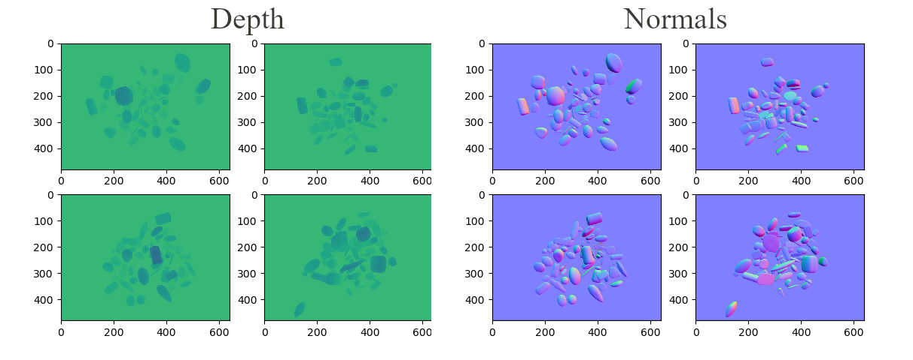

## Compositor Render Support

This directory showcases synthetic data generation using **blendtorch** for supervised machine learning. In particular, we use composite rendering to extract normals and depths from a randomized scene. The scene is composed of fixed plane and a number of parametric 3D supershapes. Using physics, we let a randomized initial object constellation fall onto the plane. Once the object come to rest (we speed up the physics, so this roughly happens after a single frame), we publish dense camera  depth and normal information.

<p align="center">

</p>

### Composite rendering
This sample uses the compositor to access different render passes. Unfortunately, Blender (2.9) does not offer a straight forward way to access the result of various render passes in memory. Therefore, `btb.CompositeRenderer` requires `FileOutput` nodes for temporary storage of data. For this purpose a fast OpenEXR reader, [py-minexr](https://github.com/cheind/py-minexr) was developed and integrated into **blendtorch**.

### Normals
Camera normals are generated by a custom geometry-based material. Since colors must be in range (0,1), but normals are in (-1,1) a transformation is applied to make them compatible with color ranges. Hence, in PyTorch apply the following transformation to get true normals
```python
true_normals = (normals - 0.5)*np.array([2., 2., -2.]).reshape(1,1,1,-1) # BxHxWx3
```

### Run

To recreate these results run [generate.py](./generate.py)
```
python generate.py
```