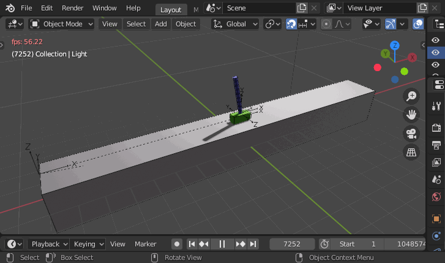
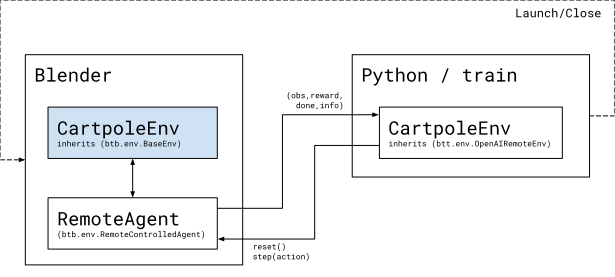

## Classic Control

This directory contains a recreation of OpenAI's `CartPole-v0` environment running in a remote Blender process. In contrast top OpenAI's version, this environment leverages Blender's built-in physics engine to simulate the cartpole. The agent operates the cart by applying forces to the cart from a separate process.

All communication is handled by **blendtorch** in the background, so it appears like any other native OpenAI environment for the agent.

<p align="center">
    
</p>

### Code

```python
import gym
import cartpole_gym

KAPPA = 30

def control(obs):
    xcart, xpole, _ = obs
    return (xpole-xcart)*KAPPA

def main():
    env = gym.make('blendtorch-cartpole-v0', real_time=False)
    
    obs = env.reset()        
    while True:
        obs, reward, done, info = env.step(control(obs))
        if done:
            obs = env.reset()
    env.done()
```
Related code: environment [cartpole_env](./cartpole_env), agent [cartpole.py](cartpole.py)

### Run it
Make sure you have Blender, **blendtorch** (see main [Readme](/Readme.md)), and OpenAI gym (`pip install gym`) installed. Navigate to `examples/control` and run 
```
python cartpole.py
```

### Real-time vs. non real-time
Environments running via **blendtorch** support a real-time execution mode `real_time=True`. When enabled, the simulation continues independent of the time it takes the agent to respond. Enabling this mode will require your agent to take into account any latency that occurs from network transmission to action computation.

### Environment rendering
We consider Blender itself as the main tool to view and (interactively) manipulate the state of the environment. In case you want a separate viewer call `env.render()` during your training loop.

### Architecture
In Reinforcement Learning (RL) we are interested in training an agent, embedded in an environment, to solve a specific task through experience. 

OpenAI's [gym](https://gym.openai.com/) offers a well established API and a set of predefined environments/tasks to work with RL challenges. Our goal with **blendtorch** is to integrate Blender as an ecosystem into OpenAI's [gym]. With Blender, the RL community gains a tool that allows them to easily model, simulate and manipulate an environment.

Our design separates the agent from the Blender environment. The figure below shows the architecture for a simple cartpole environment. While the actual environment is designed and implemented in Blender, the agent lives in a separate Python process. The agent interacts through a proxy cartpole environment with the actual environment running in Blender. The environment interface exposed to the agent follows standard OpenAI recommendations.

<p align="center">

</p>

Adding a new environment usually requires the following steps (see [cartpole_env](./cartpole_env) for details):
 - Create a new Python package `cartpole_gym`.
 - Create a new Blender scene `cartpole.blend` and model the entities required.
 - Create a new `cartpole.blend.py` to contain    
    - The environment implementation `CartpoleEnv` by inheriting from `btb.env.BaseEnv`.
    - Instantiate `CartpoleEnv` and use an instance of `btb.env.RemoteControlledAgent` upon startup.
 - Create `cartpole_env.py` and expose `CartpoleEnv` by inheriting from `btt.env.OpenAIRemoteEnv` and define OpenAI action and observation spaces.
 - Register your gym `blendtorch-cartpole-v0` with OpenAI in `__init__.py`.
 - Optionally provide a `setup.py` to make your package installable.

You may use your environment as follows
```python
import gym
import cartpole_gym

env = gym.make('blendtorch-cartpole-v0')
...
```

In the background, `btt.env.OpenAIRemoteEnv` starts a single Blender instance which executes the scene `cartpole.blend` and the script `cartpole.blend.py`. Resetting `env.reset()` and stepping `env.step()` are automatically converted to remote service calls to Blender that are invisible to the agent.


