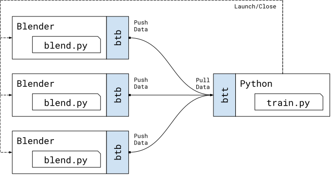

## Supervised Training Data Generation

This directory showcases synthetic data generation using **blendtorch** for supervised machine learning. In particular, several blender processes render randomized scene configurations and stream images as well as annotations into a PyTorch dataset used in training neural networks. The figure below shows a visualization of a PyTorch data set receiving images and annotations from four Blender instances. Each instance performs physical motion simulations of randomized cubes.

<p align="center">

</p>

To recreate these results run [generate.py](./generate.py) using the [falling_cubes](./) scene as follows
```
python generate.py falling_cubes
```
which will generate output images in `./tmp/output_##.png`. 

### Notes
 - [generate.py](./generate.py) also contains code for advanced features such as recording and replay.
 - Saving images is only done for demonstration purposes. **blendtorch** does not require intermediate disk storage to run.

## Code
The following snippets show the minimal necessary code to use **blendtorch** for connecting PyTorch datasets to Blender renderings/ annotations. To run the example, invoke
```
python minimal.py
```

### PyTorch
On the PyTorch side, [minimal.py](./minimal.py) performs the following important steps
 1. Launches multiple Blender processes to stream images/annotations using a particular scene/script combination.
 1. Configures a remote dataset to receive from Blender instances via network messages.

The rest follows the standard PyTorch practice.

```python
from pathlib import Path
from torch.utils import data

# Include blendtorchs PyTorch package
from blendtorch import btt

BATCH = 4
BLENDER = 2
WORKER = 4  

def main():
    launch_args = dict(
        scene=Path(__file__).parent/'cube.blend',
        script=Path(__file__).parent/'cube.blend.py',
        num_instances=BLENDER, 
        named_sockets=['DATA'],
    )

    with btt.BlenderLauncher(**launch_args) as bl:
        addr = bl.launch_info.addresses['DATA']
        
        # Create remote dataset
        ds = btt.RemoteIterableDataset(addr)

        # Limit the total number of streamed elements
        ds.stream_length(16)

        # Setup batching
        dl = data.DataLoader(ds, batch_size=BATCH, num_workers=WORKER)
        
        # Loop
        for item in dl:
            # item is a dict containing data from Blender 
            # processes batched. See cube.blend.py for details.
            img, xy = item['image'], item['xy']
            print(img.shape, xy.shape)

if __name__ == '__main__':
    main()
```
### Blender
When [minimal.py](./minimal.py) launches Blender, each instance will be running 
scene [cube.blend](./cube.blend) and script [cube.blend.py](./cube.blend.py). The latter script performs the following important steps
 1. Allocate an offscreen renderer
 1. Initializes the animation system
 1. Register callbacks for pre-frame (scene randomization) and post-frame (render and streaming)
 1. Runs the animation forever

```python
import bpy
import numpy as np

# Include blendtorchs Blender package
from blendtorch import btb

def main():
    args, remainder = btb.parse_blendtorch_args()

    cam = bpy.context.scene.camera
    obj = bpy.data.objects["Cube"]
    mat = bpy.data.materials.new(name='cube_random')
    obj.data.materials.append(mat)
    obj.active_material = mat
        
    def pre_frame():
        # Called every time before a frame is processed.
        obj.rotation_euler = np.random.uniform(0,np.pi,size=3)  
        mat.diffuse_color = np.concatenate((np.random.random(size=3), [1.]))
        
    def post_frame(off, pub, anim):
        # Called every after Blender finished processing a frame.
        pub.publish(
            image=off.render(), 
            xy=btb.camera.project_points(obj, camera=cam),
            frameid=anim.frameid
        )

    # Our output channel
    pub = btb.BlenderOutputChannel(args.btsockets['DATA'], args.btid)

    # Setup image rendering
    off = btb.OffScreenRenderer(mode='rgb')
    off.view_matrix = btb.camera.view_matrix()
    off.proj_matrix = btb.camera.projection_matrix()
    off.set_render_style(shading='RENDERED', overlays=False)

    # Setup the animation and run endlessly
    anim = btb.AnimationController()
    anim.pre_frame.add(pre_frame)
    anim.post_frame.add(post_frame, off, pub, anim)    
    anim.play(frame_range=(0,100), num_episodes=-1)

main()
```

## Architecture

**blendtorch** is composed of two distinct sub-packages: `bendtorch.btt` (in [pkg_pytorch](./pkg_pytorch)) and `blendtorch.btb` (in [pkg_blender](./pkg_blender)), providing the PyTorch and Blender views on **blendtorch**. 

In data streaming, we are interested in sending supervised image data from multiple Blender processes to a Python process running model training. This process is depicted below.

<p align="center">

</p>

At a top level provides `blendtorch.btt.BlenderLauncher` to launch and close Blender instances. For receiving data from Blender instances, `blendtorch.btt` provides. 

Typically a Python script, e.g `train.py`, launches and maintains one or more Blender instances using `blendtorch.btt.BlenderLauncher`. Each Blender instance will be instructed to run particular scene and script, e.g `blend.py`. Next, `train.py` creates a `RemoteIterableDataset` to listen for incoming network messages from Blender instances. We use a `PUSH/PULL` pipeline pattern that supports fair queuing and will stall Blender instances when `train.py` is too slow to process all messages. 

Each Blender instance, running `blend.py`, meanwhile creates a `blendtorch.btb.BlenderOutputChannel` to send outward messages. The addresses are taken from command-line arguments and are automatically provided by `blendtorch.btt.BlenderLauncher`. Next, `blend.py` registers the necessary animation hooks and usually creates one or more `blendtorch.btb.OffScreenRenderer` to capture offscreen images. Usually at `pre_frame` callbacks the scene is randomized and during `post_frame` the resulting frame is rendered and sent via output channel alongside with any (pickle-able) meta information desired.

### Parallism
**blendtorch** supports two kinds of parallism: Blender instances and PyTorch workers. We use a [PUSH/PULL pattern](https://learning-0mq-with-pyzmq.readthedocs.io/en/latest/pyzmq/patterns/pushpull.html) that allows us to fan out from multiple Blender instances and distribute the workload to any number of PyTorch workers. 

It is guaranteed that only one PyTorch worker receives a particular message, no message is lost, but the order in which it is received is not guaranteed. When PyTorch is too slow to process all messages in time, the Blender instances will eventually block until new slosts are available. When the number of PyTorch workers is one (i.e `num_workers=0` in DataLoader) then all messages will be received in the order they have been generated. 

Every PyTorch worker interleaves  messages from all connected Blender instances in a fair manner. You may use the `btid` message field to determine which Blender instance sent which message.


