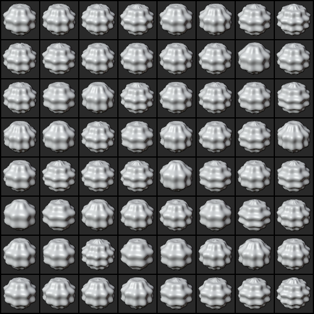
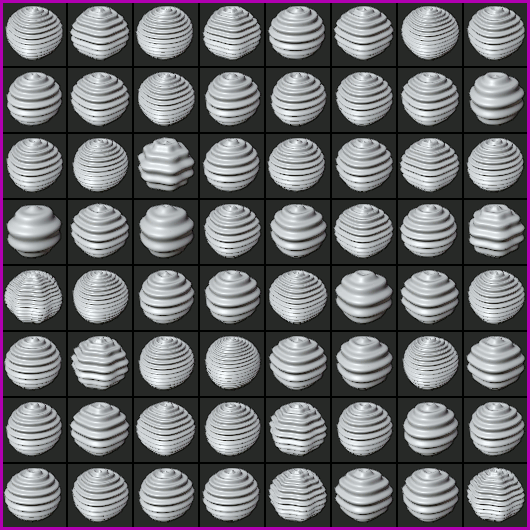

## Density Estimation

This example demonstrates optimizing simulation parameters towards target distribution parameters by minimizing the expected loss between target and simulation images measured by a learnable discriminator function. In this particular example we assume to be given a probabilistic model + a _non-differentiable_ render function to create synthetic images. Our goal is to find the distributional parametrization that created the given set of target images.

For this demo, we consider synthetic images of 3D parametric [supershapes](https://en.wikipedia.org/wiki/Superformula). A supershape can be described by 12 parameters and its appearance varies greatly along with the parameters (spheres, cubes, flower-like,...). In particular, the optimization tries to adjust the parameters `m1` and `m2` in such a way that the discriminator is not able to distinguish whether the given image is more likely to come from the simulation distribution or the target distribution. Once the discriminator reaches this state, the optimization parameters have usually converged towards the true target parameters.

Note, we can frame this example in a GAN framework: the generator consists of the probabilistic model governing the shape parameters + rendering function to generate synthetic supershape images. The discriminator is a neural network attempting to distinguish between images of the target distribution and those to the simulation distribution. 

However, there are two **key difference** to GANs: 
 1. *non-differentiable renderer*: the render function (Blender) is a considered black-box function without access to gradients. 
 1. *distributional parameters*: The parameters of the generator are distributional parameters, compared to GANs that model them as structural parameters (e.g. parameters of a neural network).
 
For both reasons, we frame out optimization as a minimization over an expected discriminator loss using gradient estimators that do not require gradients of the render function to be known. We explain our optimization idea in [this article](etc/blendtorch_stochopt.pdf).

### Results

The image series below shows images from the target distribution (left) and optimization progress as animated GIF (right). In the animation the <span style="color:purple">start</span> solution is marked with a purple border, the <span style="color:green">final</span> iteration is shown with a green border. Notice that how the shapes gradually turn into a distribution matching the target distribution on the left.
<div align="center">


</div>

### Run

To recreate these results run [densityopt.py](./densityopt.py) as follows
```
python densityopt.py
```
which will generate output images in `./tmp/` and output the optimization progress on the console 
```
D step: mean real 0.7307174801826477 mean sim 0.6040560007095337
D step: mean real 0.6737353205680847 mean sim 0.29735732078552246
D step: mean real 0.825548529624939 mean sim 0.2806171178817749
D step: mean real 0.8810040950775146 mean sim 0.1778283715248108
S step: [1.25 2.95] [0.4205084443092346, 0.4205084443092346] mean sim 0.13082975149154663
D step: mean real 0.9086431860923767 mean sim 0.21175092458724976
S step: [1.2831218 2.9007795] [0.4404144883155823, 0.4418575167655945] mean sim 0.14274010062217712
...
```
The true parameters being around 2.5/2.5 with a standard deviation of 0.1/0.1.

### Dependencies

Besides **blendtorch**, this examples requires [this tiny supershape](https://github.com/cheind/supershape) library to be acessible from within Blender (update `PYTHONPATH` prior executing the example).


